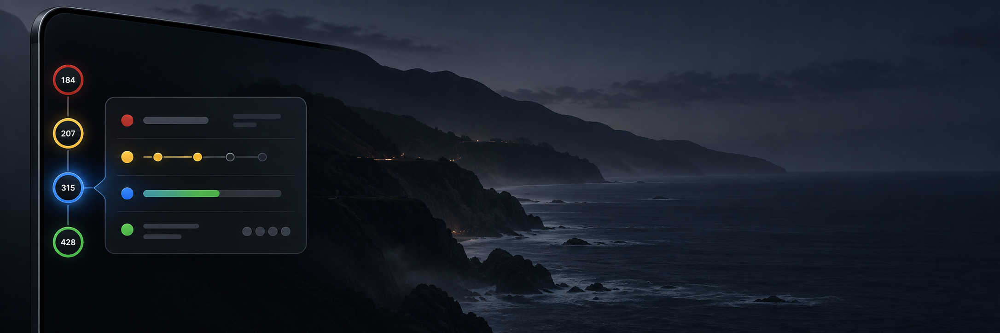

# PR Notch



PR Notch is a small native macOS companion for pull requests you authored. It lives at the edge of your display, keeps review work visible without another browser tab, and turns the state of your queue into a compact, glanceable rail.

<p align="center"><strong>See what needs your attention. Open the right PR. Keep moving.</strong></p>

## What it does

- Shows a compact left-edge rail for your open, non-draft pull requests.
- Uses one semantic ring per PR so the most important state is visible at a glance.
- Opens a focused flyout with review, CI, mergeability, relationships, and branch details.
- Groups related PRs together while preserving attention and recency order.
- Watches only the repositories you choose.
- Keeps the last complete queue visible when GitHub is slow, rate-limited, or temporarily unavailable.

PR Notch uses the GitHub CLI already installed on your Mac and its authenticated account. Hovering the rail is local UI work; it never makes an API request.

## Status at a glance

The rail shows one primary status per pull request, using the same state that opens in its flyout:

| Ring | Meaning |
| --- | --- |
| **Red** | Required CI checks are failing. |
| **Yellow** | Reviewer feedback, a merge conflict, or a required branch update needs attention. |
| **Blue** | CI is running, review is pending, or another merge gate is waiting. |
| **Green** | GitHub reports the pull request as clean and mergeable. |

When more than one condition applies, PR Notch prioritizes red, then yellow, blue, and green. Reviewer activity remains visible as its own detail so a clean merge state is not confused with completed review.

## Related pull requests

PR Notch can connect related work directly in the rail:

- **Solid** — an explicit pull-request link.
- **Dashed** — a shared Jira-style ticket key or linked GitHub issue.
- **Arrow** — a dependency such as “blocked by” or “stacked on.”

Connectors stay between ring edges, never through a PR node. Dependency relationships take precedence over direct links, which take precedence over shared-ticket relationships, so each pair has one clear explanation.

## GitHub data and refresh behavior

The refresh pipeline is designed to stay useful under real-world GitHub limits:

- Automatic refresh runs at most once every two minutes.
- Manual refresh bypasses the cooldown but still respects rate-limit protection.
- Selected repositories are applied to discovery before PR details are requested.
- Discovery, review state, CI, mergeability, and relationship data publish as one complete snapshot.
- Incomplete responses preserve the last complete queue instead of replacing it with partial data.
- Transient failures retry automatically; authentication errors are not inferred from ordinary network or rate-limit failures.
- A 60-second overall deadline prevents an endless “Refreshing…” state.
- Cached repository policy, comments, and queue data survive app restarts.

PR Notch also records its own request count and GraphQL points separately from GitHub’s shared account quota. The rolling ledger is stored at:

```text
~/Library/Application Support/PRNotch/api-usage.json
```

## Install and run

Authenticate GitHub once if needed:

```bash
gh auth login -h github.com
```

Build, install, sign, launch, and verify the app:

```bash
./script/build_and_run.sh --verify
```

By default, the verified app is installed at `~/Applications/PRNotch.app`. Set `PR_NOTCH_INSTALL_DIR` to use another location.

For deterministic visual QA with fictional representative PR states:

```bash
./script/build_and_run.sh --qa-expanded
```

Right-click the rail to refresh, copy a compact review request, open settings, or quit.

## Repository scope

Repository scope is available from the rail’s context menu and settings. The selected list is persisted in both app preferences and Application Support, so replacing the bundle does not silently reset the repositories you watch. Search supports case-insensitive regular expressions, for example:

```text
frontend|worker
```

## Requirements

- macOS 14 or later
- Swift 6.2 toolchain
- GitHub CLI (`gh`) with an authenticated GitHub account

## Project shape

This is a native Swift package with no browser runtime:

```text
Sources/PRNotch/       App, models, services, stores, and SwiftUI views
Tests/PRNotchTests/    Focused refresh and status tests
script/                Build, install, launch, and QA helpers
```

## Visual QA

Repository screenshots must use the app’s fictional preview fixtures. Do not capture live repository names, pull-request numbers, reviewer identities, desktop contents, or display details in project artifacts. See [`design-qa.md`](design-qa.md) for the safe QA workflow and required visual surfaces.
